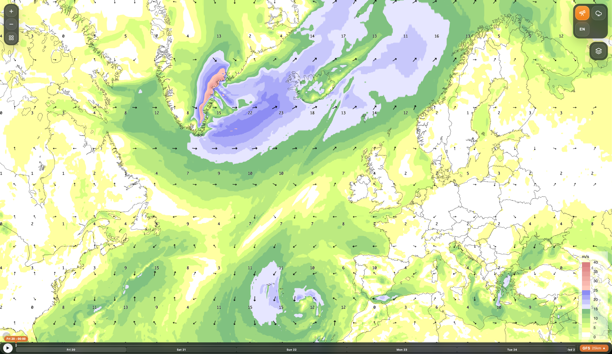

# Mímir by Belgingur

[](https://github.com/belgingur/Mimir/actions/workflows/ci.yml)
[](LICENSE)

Mímir is a browser-based weather map viewer built with [MapLibre GL](https://maplibre.org/), [deck.gl](https://deck.gl/), and [WeatherLayers GL](https://weatherlayers.com/). It renders forecast layers from WeatherLayers-compatible WebP tile datasets and provides timeline playback, layer controls, wind visualisations, localisation, and optional wavegram popups.



This repository contains the frontend viewer only. It does not include Belgingur production data, private services, or data-generation pipelines. To use it with meaningful forecast layers you will need to provide your own compatible data service or local `public/forecast-data` dataset. See [Forecast Data](#forecast-data).

## ⚠️ Dependency Licensing Note

This project depends on [WeatherLayers GL](https://weatherlayers.com/), which is a **commercial library** with its own license. The MIT license in this repository covers only Mímir's own source code. To use or distribute this application you must obtain a valid WeatherLayers GL license separately.

## Features

- MapLibre basemap with deck.gl and WeatherLayers overlays
- Forecast layer groups for temperature, wind, precipitation, cloud cover, snow depth, and waves
- Timeline playback across forecast frames
- Wind arrows, particles, and streamlines
- Iconography view for compact weather symbols at cities or stations
- Optional GWES-style wavegram popups when a wavegram service is configured
- Localised UI for English, Icelandic, Faroese, Polish, Spanish, Portuguese.
- TypeScript source with Vitest coverage for controller and library behaviour

## Known Limitations

- **Firefox**: Wind particles require WebGL2 and are not supported in Firefox. Use arrows or streamlines as alternatives.
- **Wavegrams**: Wavegram popups call the Belgingur API by default (`https://wod.belgingur.is`). Override with `VITE_BELGINGUR_BASE_URL` if needed. See [Wavegram Service](#wavegram-service).
- **Data pipeline not included**: Mímir is a viewer for prepared WeatherLayers-compatible datasets, not a complete forecasting pipeline.

## Requirements

- Node.js 22
- npm
- A [MapTiler](https://www.maptiler.com/) API key for the Positron basemap
- A WeatherLayers GL license

## Quick Start

```bash
npm install
cp .env.example .env          # fill in your keys
npm run dev
```

Open `http://localhost:5173` in your browser.

Without a forecast dataset the app shell and basemap will load, but weather layers need compatible catalog and WebP frame files. See [Forecast Data](#forecast-data).

## Configuration

Environment variables are read by Vite and must use the `VITE_` prefix. Copy `.env.example` to `.env` for local development - this file is gitignored.

| Variable                  | Required | Description                                                                                                                       |
| ------------------------- | -------: | --------------------------------------------------------------------------------------------------------------------------------- |
| `VITE_MAPTILER_KEY`       |      Yes | MapTiler key for the Positron basemap style.                                                                                      |
| `VITE_INHOUSE_ROOT`       |       No | Origin prefix for forecast data requests. Defaults to same-origin. Set to a CDN or API origin without appending `/forecast-data`. |
| `VITE_BELGINGUR_BASE_URL` |       No | Base URL for wavegram PNG endpoints. Defaults to `https://wod.belgingur.is`. Set to empty to disable outbound wavegram calls.     |

## Scripts

```bash
npm run dev            # start Vite dev server
npm run build          # type-check and build production assets
npm run preview        # preview a production build
npm test               # run Vitest once
npm run test:coverage  # run tests with coverage
npm run test:watch     # run tests in watch mode
```

## Forecast Data

Mímir expects forecast data under a `forecast-data` catalog. In local development this means placing files under `public/forecast-data/`. If `VITE_INHOUSE_ROOT` is set, requests go to that origin instead.

The conversion scripts write to `<out-root>/forecast-data/`; copy that directory's contents into `public/forecast-data/` for local development (the sample dataset in this repo follows that layout directly).

### Sample Dataset

This repository includes a small sample dataset under `public/forecast-data/` so the viewer works out of the box after `npm run dev`. It contains:

- **GFS** — 8 variables (temperature, wind speed/direction, precipitation, cloud cover, snow depth, snow fraction, and a combined 10 m wind U/V vector layer) for analysis time `2026-05-25_00`, 121 hourly frames (~5 days)
- **GWES** — 3 wave variables (significant wave height, primary wave mean period, primary wave direction) for analysis time `2026-05-25_00`, 81 frames at 3-hour intervals (~10 days)

> **Note:** This is a fixed-date, single-analysis-run dataset intended for testing and demonstration only. It is not updated and should be replaced with real operational data for production use. See [`scripts/`](scripts/) for tools to convert your own NetCDF output into this format.

### Directory Structure

```text
public/forecast-data/
  models.json
  <model>/
    analyses.json
    <analysis>/
      variables.json
      <variable>/
        manifest.json
        <frame files>
```

### Catalog Files

`models.json` - lists available models:

```json
{
  "schemaVersion": 1,
  "models": [
    { "id": "GFS", "title": "GFS", "default": true },
    { "id": "GWES", "title": "GWES", "default": false }
  ]
}
```

`<model>/analyses.json` - lists available forecast runs:

```json
{
  "schemaVersion": 1,
  "model": "GFS",
  "analyses": ["2026-05-25_00"],
  "latest": "2026-05-25_00"
}
```

`<model>/<analysis>/variables.json` - lists available variables:

```json
{
  "schemaVersion": 1,
  "model": "GFS",
  "analysis": "2026-05-25_00",
  "variables": [
    {
      "id": "air_temperature_at_2m_agl",
      "title": "Temperature at 2m",
      "unit": "°C",
      "manifest": "air_temperature_at_2m_agl/manifest.json",
      "defaultLayer": "raster"
    }
  ]
}
```

### Variable Manifests

Each variable manifest describes the frame grid, time axis, encoding, and file template. Key fields used by the app:

| Field                    | Description                                                                   |
| ------------------------ | ----------------------------------------------------------------------------- |
| `bounds`                 | Geographic bounding box                                                       |
| `shape`                  | Grid dimensions                                                               |
| `srcMin` / `srcMax`      | Physical value range                                                          |
| `imageUnscale`           | Decode coefficients from image channels to physical values                    |
| `fileTemplate`           | URL template for frame files                                                  |
| `count` / `times`        | Number of frames and their timestamps                                         |
| `analysisTime`           | Model run time                                                                |
| `historyIntervalMinutes` | Spacing of historical frames                                                  |
| `imageScale`             | `"linear"` (default) or `"log1p"` for log-scaled variables such as snow depth |

Scalar variables use RGBA image frames with `A == 0` as nodata. Log-scaled variables are encoded with `log1p` and decoded with `expm1`. Vector wind layers expect U and V components packed into image channels per the manifest unscale metadata.

### Wavegram Service

GWES wave layers support spread wavegram popups. By default the app requests PNGs from `https://wod.belgingur.is` (Belgingur Trellis). Set `VITE_BELGINGUR_BASE_URL` to point at another compatible service, or set it to empty to show a configuration message instead of calling out.

## Data Preparation

The [`scripts/`](scripts/) directory contains tools for building forecast datasets from NetCDF model output:

- **`netcdf2image.py`** — converts NetCDF variables to WebP/PNG frames and writes the catalog structure (`models.json`, `analyses.json`, `variables.json`, per-variable `manifest.json`). Output lands in `<out-root>/forecast-data/`; copy those files into `public/forecast-data/` for local development.
- **`stitch_rap_forecast.py`** and **`stitch_icon_forecast.py`** — extend short RAP or ICON-EU runs with tail frames from the previous long run, for operational update schedules that alternate run lengths.

Example YAML configs (`config_GFS.yml`, `config_GWES.yml`) and a curated scaling policy (`manifest_scaling_v2.yml`) are included. See [`scripts/README.md`](scripts/README.md) for installation, usage examples, and stitching workflow details.

## Project Layout

```text
src/
  main.ts             app bootstrap and MapLibre setup
  controllers/        stateful UI and map controllers
  lib/                pure helpers, data parsing, scales, geometry, persistence
  locales/            translation bundles
  styles/             CSS tokens, layout, and component styles
  types/              local TypeScript declarations
  vendor/             vendored browser-side rendering helpers
  workers/            off-main-thread contour and streamline workers
tests/                Vitest test suite
scripts/              NetCDF conversion and forecast-run stitching helpers
patches/              patch-package patches applied after install
public/               static assets and optional local forecast data
scales/               colour scale reference assets
docs/                 screenshots and other documentation assets
```

## Architecture

`src/main.ts` is intentionally thin. Behaviour lives in domain controllers:

- `InhouseCatalogController` - loads model, analysis, variable, and frame metadata
- `LayerComposer` - builds MapLibre, deck.gl, and WeatherLayers layers
- `LayerGroupController`, `TimelineController`, `ModelChooserController` - primary UI state
- `WindStyleController` - selects wind arrows, particles, or streamlines
- `WavegramController` - handles optional wavegram popups
- `IconographyController` - renders compact weather-symbol views

Pure functions and reusable utilities live under `src/lib/`. Worker-heavy work (contour generation, streamlines) is isolated under `src/workers/`.

## Testing

```bash
npm test               # run once
npm run test:coverage  # with coverage report
npm run test:watch     # watch mode
```

The test suite uses Vitest and jsdom. GitHub Actions runs type-checking and tests on pushes and pull requests to `main`. A separate gitleaks workflow handles secret scanning.

## Build Notes

`npm run build` passes from a clean checkout. If you keep local forecast data under `public/forecast-data/`, make sure it is not a recursive symlink - Vite copies `public/` during production builds.

One `patch-package` patch is applied after install: `@luma.gl+webgl+9.3.3`, which fixes texture upload unpack parameters.

## Contributing

Contributions are welcome. Please open an issue before starting significant work so we can discuss the approach.

- **Bug reports**: include browser, OS, and steps to reproduce
- **Pull requests**: keep them focused; one concern per PR
- **Tests**: new behaviour should include Vitest tests where practical
- **Code style**: follow the patterns already in `src/controllers/` and `src/lib/`; TypeScript strict mode is enforced

For questions or discussion, open a GitHub issue.

## License

MIT - see [LICENSE](LICENSE). Note that the WeatherLayers GL dependency has its own commercial license terms; see [Dependency Licensing Note](#dependency-licensing-note) above.
